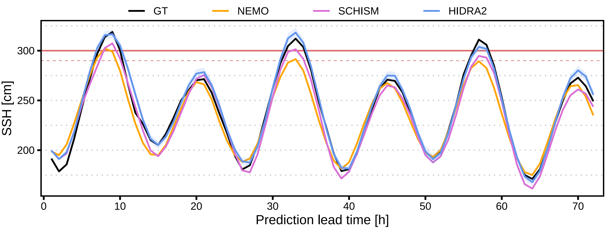

## HIDRA2: Deep-Learning Ensemble Sea Level and Storm Tide Forecasting in the Presence of Seiches – the Case of Northern Adriatic

[`paper`](https://doi.org/10.5194/gmd-16-271-2023) [`BibTeX`](#ref)

<p align="center">
    
</p>

HIDRA2 is a state-of-the-art deep neural model for sea-level prediction based on past
sea level observations and future tidal and atmospheric forecasts.
This repository contains the implementation of HIDRA2 and code to
train and evaluate the model. We also include HIDRA2 weights pretrained on 2006 – 2018 and
predictions for all 50 ensembles on Jun 2019 – Dec 2020. Training and test datasets are published at
destinations listed below.



### Setup

To install the required packages, run

```
pip3 install -r requirements.txt
```

### Evaluation

Predictions of HIDRA2 on Jun 2019 – Dec 2020 are stored in the `data` folder.
To evaluate them, run

```
cd src
python3 eval.py
```

To recalculate the predictions, download the test data from [this link](https://doi.org/10.5281/zenodo.7304086)
and run

```
cd src
python3 test.py
```

### Training

Pretrained weights are available in the `data` folder. To retrain the model, download
the training data from [this link](https://doi.org/10.5281/zenodo.7304086) and run

```
cd src
python3 train.py
```

The code will train the model on 2006 – 2018 data and save the trained model to the `data` folder.

### Structure of the Data

Inputs to the HIDRA2 model are atmospheric, SSH and tidal data, each structured as follows:

| Name    | Shape   | Description                                                                                                                                                                                       |
|---------|---------|---------------------------------------------------------------------------------------------------------------------------------------------------------------------------------------------------|
| `atmos` | 96 × 3 × 9 × 12 | Hourly atmospheric forecasts from 24 h prior the prediction point to 72 h into the future. Second dimension contains pressure and two channels of wind. Last two dimensions are latitude and longitude. |
| `ssh`   | 72      | Past SSH.                                                                                                                                                                                         |
| `tide`  | 144     | Past and future tide.                                                                                                                                                                             |

The model outputs 72 points representing hourly sea level forecast. 
All inputs and output of HIDRA2 are normalized, the statistics are stored in `data/normalization_parameters.yaml`.

### Publication

<a name="ref"></a>Rus, M., Fettich, A., Kristan, M., and Ličer, M.: HIDRA2: deep-learning ensemble sea level and storm tide forecasting in the presence of seiches – the case of the northern Adriatic, Geosci. Model Dev., 16, 271–288, https://doi.org/10.5194/gmd-16-271-2023, 2023.

Cite as:
```
@Article{gmd-16-271-2023,
    AUTHOR = {Rus, M. and Fettich, A. and Kristan, M. and Li\v{c}er, M.},
    TITLE = {HIDRA2: deep-learning ensemble sea level and storm tide forecasting in the presence of seiches -- the case of the northern Adriatic},
    JOURNAL = {Geoscientific Model Development},
    VOLUME = {16},
    YEAR = {2023},
    NUMBER = {1},
    PAGES = {271--288},
    URL = {https://gmd.copernicus.org/articles/16/271/2023/},
    DOI = {10.5194/gmd-16-271-2023}
}
```
