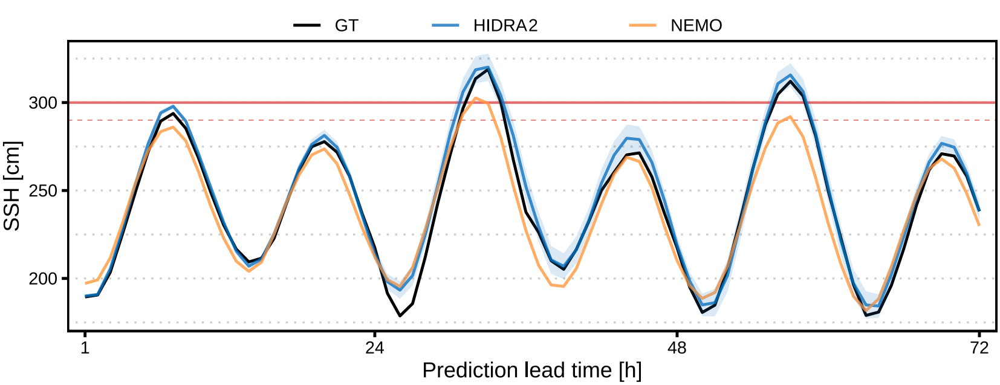

## HIDRA2: Deep-Learning Ensemble Storm Surge Forecasting in the Presence of Seiches – the Case of Northern Adriatic

<p align="center">
    
</p>

HIDRA2 is a state-of-the-art deep neural model for sea-level prediction based on past
sea level observations and future tidal and atmospheric forecasts.
This repository contains the implementation of HIDRA2, and source code to
train and evaluate the model. We also include HIDRA2 weights pretrained on 2006 – 2018 and
predictions for all 50 ensembles on Jun 2019 – Dec 2020.



### Training and Evaluation Datasets

We publish the entire training and evaluation datasets for HIDRA2 at the following link. To run
the following experiments, place the files into the `data` folder.

### Setup

To install the required packages, run

```
pip3 install -r requirements.txt
```

### Training

Pretrained weights are available in the `data` folder. To retrain the model, download
the training data and run

```
python3 train.py
```

The code will train the model on 2006 – 2018 data and save the trained model to the `data` folder.

### Evaluation

Predictions of HIDRA2 on Jun 2019 – Dec 2020 are already stored in the `data` folder. 
To recalculate them, run

```
python3 test.py
```

To evaluate the predictions, run

```
python3 eval.py
```

### Structure of the Data

Inputs to the HIDRA2 model are atmospheric, ssh and tidal data, each structured as follows:

| Name    | Shape   | Description                                                                                                                                                                                       |
|---------|---------|---------------------------------------------------------------------------------------------------------------------------------------------------------------------------------------------------|
| `atmos` | 96 × 3 × 9 × 12 | Hourly atmospheric forecasts from 24 h prior the prediction point to 72 h into the future. Second dimension contains pressure and two channels of wind. Last two dimensions are height and width. |
| `ssh`   | 72      | Past SSH.                                                                                                                                                                                         |
| `tide`  | 144     | Past and future tide.                                                                                                                                                                             |

The model outputs 72 points representing hourly sea level forecast. 
All inputs and output of HIDRA2 are normalized, the statistics are stored in `data/data normalization parameters.yaml`.
